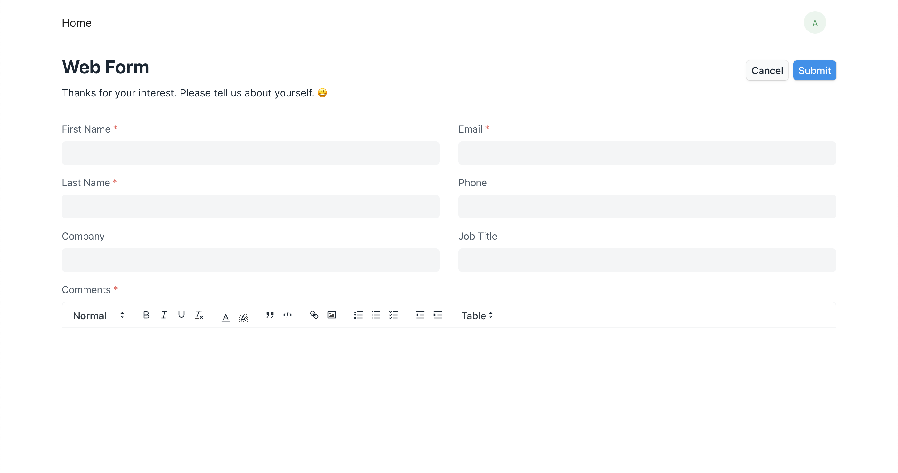
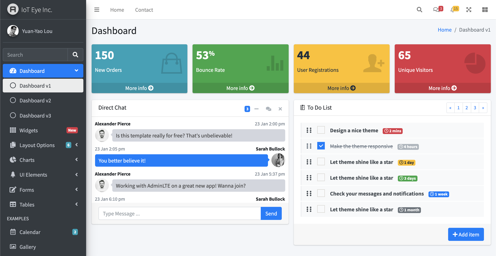

# Frappe Apps Development
This repository aims at providing general usage of Frappe framework and steps to build Frappe Apps.
* Basic
  * [Usage of Frappe Bench](#basic-usage)  
* Web
  * [WebForm and DocType](#web-form)  
  * [Custom WebForm](#custom-web-form)  
  * [Custom Page to Retrieve DocType Data](#custom-page)  
* Report
  * [Query Type](#query-report)  
  * [Script Type](#script-report)  
* Integration
  * [Bootstrap 5](#bootstrap-5)  
  * [AdminLTE v3](#admin-lte)

<br>

<a name="basic-usage"/>

## Basic - Usage of Frappe Bench
```shell
# Create New Frappe App / Get Existing Frappe App
bench new-app     <APP_NAME>
bench get-app     <GIT_URL>

# Install Frapp App to Frapp Site
bench --site      <SITE_NAME>           \
      install-app <APP_NAME>
      
# Frappe DB Backup / Restore
bench --site      <SITE_NAME>           \
      backup  --backup-path <ABS_PATH>  \

bench --site      <SITE_NAME>           \
      restore     <BACKUP_DB_GZ_FILE>
```

<br>
<br>

<a name="web-form"/>

## Web - WebForm and DocType


```INI
# ==================================================================================
#  Reference Settings                      (refer to JSON file for more details)   =
# ==================================================================================
# Folder Structure: APP_NAME/MODULE_NAME/TYPE/NAME

[Module] web-form            (Folder: frappe_apps/web_form)

[Type]
DocType = Web Form Data      (Folder: frappe_apps/web_form/doctype/web_form_data)
WebForm = Web Form           (Folder: frappe_apps/web_form/web_form/web_form)

[Permission]
DocType = Guest: Read, Write, Create
```
1. Create **'Module'** under your Frapp app
2. Create **'DocType'** to store web form data under the related module ([JSON](https://github.com/yylou/frappe-apps/blob/main/frappe_apps/web_form/doctype/web_form_data/web_form_data.json))
```INI
[Fileds]
/-----------------------------------------------------------------\
|     Label     |     Type     |     Name     |     Mandatory     |
|-----------------------------------------------------------------|
|  First Name   |  Data        |  first_name  |  Yes              |
|  Last Name    |  Data        |  last_name   |  Yes              |
|  Phone        |  Data        |  phone       |                   |
|  Email        |  Data        |  email       |  Yes              |
|  Company      |  Data        |  company     |                   |
|  Job Title    |  Data        |  job_title   |                   |
|  Comments     |  Data        |  comments    |  Yes              |
\-----------------------------------------------------------------/
```
3. Create **'WebForm'** linked with the DocType and Module above ([JSON](https://github.com/yylou/frappe-apps/blob/main/frappe_apps/web_form/web_form/web_form/web_form.json))
```INI
[Fileds]
/-----------------------------------------------------------------\
|       Fieldname       |        Fieldtype        |     Label     |
|-----------------------------------------------------------------|
|  first_name           |  Data                   |  First Name   |
|  last_name            |  Data                   |  Last Name    |
|                       |  Column Break           |               |
|  email                |  Data                   |  Email        |
|  phone                |  Data                   |  Phone        |
|                       |  Section Break          |               |
|  company              |  Data                   |  Company      |
|                       |  Column Break           |               |
|  job_title            |  Data                   |  Job Title    |
|                       |  Section Break          |               |
|  comments             |  Text Editor            |  Comments     |
\-----------------------------------------------------------------/
```
4. Input data via WebForm web page or via REST API (Guest is allowed due to permission settings)
```shell
# URL Format: <DOMAIN>/api/resource/<DOCTYPE>

curl -X POST https://<DOMAIN>/api/resource/Web%20Form%20Data    \
     -H 'Content-Type: application/json'                       \
     -H 'Accept: application/json'                             \
     -d '{"first_name":"Guest", "last_name":"Test", "email":"guest.test@example.com", "comments":"Hello World"}'
```

<br>
<br>

<a name="custom-web-form"/>

## Web - Custom WebForm


```INI
[File] 
HTML       = custom-web-form.html   (Folder: frappe_apps/www)
Javascript = custom_web_form.js     (Folder: frappe_apps/www)
Python     = custom_web_form.py     (Folder: frappe_apps/www)
```
1. Create HTML, Javascript (client-side), and Python (server-side) files under **'www'** folder
2. Design 'Form' in [HTML](https://github.com/yylou/frappe-apps/blob/main/frappe_apps/www/custom-web-form.html), Front-end reactions in [Javascript](https://github.com/yylou/frappe-apps/blob/main/frappe_apps/www/custom_web_form.js), and Back-end response in [Python](https://github.com/yylou/frappe-apps/blob/main/frappe_apps/www/custom_web_form.py)

<br>
<br>

<a name="custom-page"/>

## Web - Custom Page to Retrieve DocType Data


```INI
[File] 
HTML       = retrieve-data.html     (Folder: frappe_apps/www)
Python     = retrieve_data.py       (Folder: frappe_apps/www)
```
1. Create HTML and Python (server-side) files under **'www'** folder
2. Design 'Table' in [HTML](https://github.com/yylou/frappe-apps/blob/main/frappe_apps/www/retrieve-data.html) and Back-end response in [Python](https://github.com/yylou/frappe-apps/blob/main/frappe_apps/www/retrieve_data.py) (here we get Frappe data by **'frappe.get_list'**)

<br>
<br>

<a name="query-report"/>

## Report - Query Type


```INI
# ==================================================================================
#  Reference Settings                      (refer to JSON file for more details)   =
# ==================================================================================
# Folder Structure: APP_NAME/MODULE_NAME/TYPE/NAME

[DocType] Web Form Data        (Folder: frappe_apps/web_form/doctype/web_form_data)
[Module]  report               (Folder: frappe_apps/report)

[Type]
Report  = Query Report         (Folder: frappe_apps/report/report/query_report)

[File]
Javascript = query_report.js   (Folder: frappe_apps/report/report/query_report)
```
1. Create **'Module'** under your Frapp app
2. Create **'Report'** linked with the DocType and Module above ([JSON](https://github.com/yylou/frappe-apps/blob/main/frappe_apps/report/report/query_report/query_report.json))
3. Add required information in the **'Columns'** and **'Filters'** sections (referred to following table content)
```INI
[Columns]
/-------------------------------------------------\
|    Fieldname    |    Label    |    Fieldtype    |
|-------------------------------------------------|
|  id             |  ID         |  Data           |
|  first_name     |  First Name |  Data           |
|  last_name      |  Last Name  |  Data           |
|  email          |  Email      |  Data           |
|  phone          |  Phone      |  Data           |
|  creation       |  Creation   |  Data           |
\-------------------------------------------------/

[Filters]
/-------------------------------------------------\
|    Fieldname    |    Label    |    Fieldtype    |
|-------------------------------------------------|
|  from_date      |  From       |  Date           |
|  to_date        |  To         |  Date           |
|  first_name     |  First Name |  Data           |
\-------------------------------------------------/
```
4. Create [Javascript](https://github.com/yylou/frappe-apps/blob/main/frappe_apps/report/report/query_report/query_report.js), for filtering purpose
```Javascript
/*
 *  @path      frappe_apps/report/report/query_report
 *  @filename  query_report.js
 */ 

frappe.query_reports['Query Report'] = {
    "filters": [
        {
            'fieldname':    'from_date',
            'label':        __( 'From' ),
            'fieldtype':    'Date',
	      'default':      '2021-01-01',
            'reqd':         1
        },
        {
            'fieldname':    'to_date',
            'label':        __( 'To' ),
            'fieldtype':    'Date',
	      'default':      get_today(),
            'reqd':         1
        },
        {
            'fieldname':    'first_name',
            'label':        __( 'First Name' ),
            'fieldtype':    'Data',
	      'default':      '%',
            'reqd':         1
        },
    ]
}
```

<br>
<br>

<a name="script-report"/>

## Report - Script Type


```INI
# ==================================================================================
#  Reference Settings                      (refer to JSON file for more details)   =
# ==================================================================================
# Folder Structure: APP_NAME/MODULE_NAME/TYPE/NAME

[DocType] Web Form Data        (Folder: frappe_apps/web_form/doctype/web_form_data)
[Module]  report               (Folder: frappe_apps/report)

[Type]
Report  = Script Report        (Folder: frappe_apps/report/report/script_report)

[File]
Javascript = script_report.js  (Folder: frappe_apps/report/report/script_report)
Python     = script_report.py  (Folder: frappe_apps/report/report/script_report)
```
1. Create **'Report'** linked with the DocType and Module (.js and .py will be generated automatically) ([JSON](https://github.com/yylou/frappe-apps/blob/main/frappe_apps/report/report/script_report/script_report.json))
2. Modify **['script_report.js'](https://github.com/yylou/frappe-apps/blob/main/frappe_apps/report/report/script_report/script_report.js)** to enable filtering functions so that server-side script (Python) could catch it
3. Modify **['script_report.py'](https://github.com/yylou/frappe-apps/blob/main/frappe_apps/report/report/script_report/script_report.py)** to deal with table format and how filtering functinos work and response to client-side

<br>
<br>

<a name="bootstrap-5"/>

## Integration - Bootstrap 5


1. Clone Bootstrap 5 GitHub Repository (Here we take [Stylish Portfolio](https://github.com/StartBootstrap/startbootstrap-stylish-portfolio) as example for tutorial)
```shell
git clone https://github.com/StartBootstrap/startbootstrap-stylish-portfolio.git
```
2. Move out necessary files such as **source files, npm-build scripts, and npm package file**
```shell
mv startbootstrap-stylish-portfolio/{src,scripts,*.json} .
```
3. Remove redundant files
```shell
rm -rf startbootstrap-stylish-portfolio
```
4. Install Node modules
```
npm install
```
5. Modify npm package file ```package.json``` for **npm-build process and integration with Frappe framework** [(Reference Code)](https://github.com/yylou/frappe-apps/blob/3d6930864a535ade469cab2a095fb5eeb588cb68/package.json#L5-L17)
```json
    "scripts": {
        "build": "npm run clean && npm run build:pug && npm run build:scss && npm run build:scripts && npm run build:assets && npm run integrate:clean && npm run integrate:frappe",
        "build:assets": "node scripts/build-assets.js",
        "build:pug": "node scripts/build-pug.js",
        "build:scripts": "node scripts/build-scripts.js",
        "build:scss": "node scripts/build-scss.js",
        "clean": "node scripts/clean.js",
        "start": "npm run build && node scripts/start.js",
        "start:debug": "npm run build && node scripts/start-debug.js",

        "integrate:clean": "node scripts/integrate-clean.js",
        "integrate:frappe": "node scripts/integrate-frappe.js"
    },
```
6. ***(Optional)*** Modify source files (website-design-related files) to include static files (assets, css, and javascripts) with new paths. In this tutorial, we modify [```src/pug/index.pug```](https://github.com/yylou/frappe-apps/blob/main/src/pug/index.pug), [```src/scss/sections/_cta.scss```](https://github.com/yylou/frappe-apps/blob/main/src/scss/sections/_cta.scss), and [```src/scss/sections/_masthead```](https://github.com/yylou/frappe-apps/blob/main/src/scss/sections/_masthead.scss) (Click each link to check the modifications). Take ```index.pug``` as example:
```pug
// Favicon
link(rel='icon', type='image/x-icon', href='/assets/frappe_apps/bootstrap-5/favicon.ico')
//- link(rel='icon', type='image/x-icon', href='assets/favicon.ico')

// Core theme CSS (includes Bootstrap)
link(href='/assets/frappe_apps/bootstrap-5/css/styles.css', rel='stylesheet')
//- link(href='css/styles.css', rel='stylesheet')

// Portfolio
//- img.img-fluid(src='assets/img/portfolio-1.jpg', alt='...')
img.img-fluid(src='/assets/frappe_apps/bootstrap-5/img/portfolio-1.jpg', alt='...')
```
7. To enable Frappe-powered features, add following contents into PUG file [```src/png/index.png```](https://github.com/yylou/frappe-apps/blob/main/src/pug/index.pug)
```pug
head
    // Frappe Integration
    script.
        window.frappe = {};
        frappe.ready_events = [];
        frappe.ready = function(fn) {
        frappe.ready_events.push(fn);
        }
        window.dev_server = {{ dev_server }};
        window.socketio_port = {{ (frappe.socketio_port or 'null') }};
        window.show_language_picker = {{ show_language_picker }};
        window.is_chat_enabled = {{ chat_enable }};

body#page-top
    // Frappe Integration
    script(type='text/javascript', src='/assets/js/frappe-web.min.js?ver={{ build_version }}')
    |       
    script(type='text/javascript', src='{{ link | abs_url }}?ver={{ build_version }}')
    |       
```
8. Build the app
```shell
# Frappe command 'bench build' will execute 'npm run build' for each Frappe app with package.json
bench build --app frappe_apps
```

<br>
<br>

<a name="admin-lte"/>

## Integration - AdminLTE v3


1. Clone [AdminLTE v3](https://github.com/ColorlibHQ/AdminLTE/tree/master) GitHub Repository
```shell
git clone https://github.com/ColorlibHQ/AdminLTE.git
```
2. Move out necessary files such as **source files (website-design-related files) and npm package file**
```shell
mv AdminLTE/{package*,build}    .
mv AdminLTE/dist/img            frappe_apps/public/
mv AdminLTE/index.html          frappe_apps/www/admin.html
```
3. Remove redundant files
```shell
rm -rf AdminLTE
```
4. Install Node modules
```shell
npm install
```
5. Modify npm package file ```package.json``` for **npm-build process and integration with Frappe framework**.
```json
    "scripts": {
        "bundlewatch": "bundlewatch --config .bundlewatch.config.json",
        "css": "npm-run-all css-compile css-prefix css-minify",
        "css-splits": "npm-run-all css-compile-splits css-prefix-splits css-minify-splits",
        "css-all": "npm-run-all --parallel css css-splits",
        "css-compile-bash": "node-sass --importer node_modules/node-sass-package-importer/dist/cli.js --output-style expanded --source-map true --source-map-contents true --precision 6 ",
        "css-compile": "npm run css-compile-bash -- build/scss/adminlte.scss dist/css/adminlte.css",
        "css-compile-splits": "npm run css-compile-bash -- build/scss/parts -o dist/css/alt/",
        "css-prefix": "postcss --config build/config/postcss.config.js --replace \"dist/css/*.css\" \"!dist/css/*.min.css\"",
        "css-prefix-splits": "postcss --config build/config/postcss.config.js --replace \"dist/css/alt/*.css\" \"!dist/css/alt/*.min.css\"",
        "css-minify-bash": "cleancss -O1 --format breakWith=lf --with-rebase --source-map --source-map-inline-sources --output ",
        "css-minify": "npm run css-minify-bash -- dist/css/ --batch --batch-suffix \".min\" \"dist/css/*.css\" \"!dist/css/*.min.css\"",
        "css-minify-splits": "npm run css-minify-bash -- dist/css/alt/ --batch --batch-suffix \".min\" \"dist/css/alt/*.css\" \"!dist/css/alt/*.min.css\"",
        "css-lint": "stylelint \"build/scss/**/*.scss\" --cache --cache-location .cache/.stylelintcache",
        "compile": "npm-run-all --parallel js css-all",
        "dev": "npm-run-all --parallel watch sync",
        "docs": "npm-run-all docs-prepare docs-compile",
        "docs-lint": "node build/npm/vnu-jar.js",
        "docs-compile": "cd docs/ && bundle exec jekyll build -d ../docs_html",
        "docs-serve": "npm-run-all compile docs-prepare && cd docs/ && bundle exec jekyll serve",
        "docs-prepare": "node build/npm/DocsPublish.js -v",
        "lockfile-lint": "lockfile-lint --allowed-hosts npm --allowed-schemes https: --empty-hostname false --type npm --path package-lock.json",
        "postinstall": "npm run plugins",
        "js": "npm-run-all js-compile js-minify",
        "js-compile": "rollup --config build/config/rollup.config.js --sourcemap",
        "js-minify": "terser --compress typeofs=false --mangle --comments \"/^!/\" --source-map \"content=dist/js/adminlte.js.map,includeSources,url=adminlte.min.js.map\" --output dist/js/adminlte.min.js dist/js/adminlte.js",
        "js-lint": "eslint --cache --cache-location .cache/.eslintcache --report-unused-disable-directives .",
        "lint": "npm-run-all --continue-on-error --parallel css-lint js-lint lockfile-lint",
        "production": "npm-run-all --parallel compile plugins",
        "prepare-release": "npm-run-all production docs",
        "test": "npm-run-all lint production",
        "plugins": "node build/npm/Publish.js -v",
        "sync": "browser-sync start --server --files *.html pages/ dist/",
        "watch": "concurrently \"npm run watch-css\" \"npm run watch-js\"",
        "watch-css": "nodemon --watch build/scss -e scss -x \"npm-run-all css-lint css\"",
        "watch-js": "nodemon --watch build/js -e js -x \"npm-run-all js-lint js\"",

        "build": "npm run production && npm run integrate-clean && npm run integrate-frappe",
        "integrate-clean": "rm -rf ioteye_web/public/admin-lte",
        "integrate-frappe": "mv dist ioteye_web/public/admin-lte && mv plugins ioteye_web/public/admin-lte/ && rm -rf dist plugins"
    },
```
6. ***(Optional)*** Modify ```ioteye_web/www/admin.html``` to include static files (assets, css, and javascripts) with new paths.
```shell
sed -i "" 's/\"dist\/img\//\"\/assets\/ioteye_web\/img\//'               ioteye_web/www/admin.html
sed -i "" 's/\"plugins\//\"\/assets\/ioteye_web\/admin-lte\/plugins\//'  ioteye_web/www/admin.html
sed -i "" 's/\"dist\//\"\/assets\/ioteye_web\/admin-lte\//'              ioteye_web/www/admin.html
```
7. To enable Frappe-powered features, add following contents into HTML file
```html
<head>
    ...

    <!-- Add Frappe-related Script inside 'head' tag -->
    <script>
        window.frappe = {};
        frappe.ready_events = [];
        frappe.ready = function(fn) {
            frappe.ready_events.push(fn);
        }
        window.dev_server = {{ dev_server }};
        window.socketio_port = {{ (frappe.socketio_port or 'null') }};
        window.show_language_picker = {{ show_language_picker }};
        window.is_chat_enabled = {{ chat_enable }};
    </script>
</head>

<body>
    ...

    <!-- Add Frappe-related Script inside 'body' tag -->
    <script type="text/javascript" src="/assets/js/frappe-web.min.js?ver={{ build_version }}"></script>
    
    <script type="text/javascript" src="{{ link | abs_url }}?ver={{ build_version }}"></script>
    
</body>
```
8. Build the app
```shell
# Frappe command 'bench build' will execute 'npm run build' for each Frappe app with package.json
bench build --app frappe_apps
```
